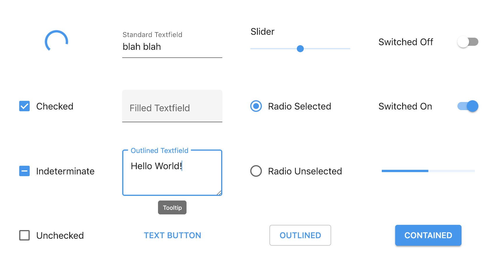

<p align="center">
  
</p>

<h1 align="center">Matter</h1>

<p align="center">Material Design Components in Pure CSS</p>

<p align="center">Materializing HTML at just one class per component (<a href="https://codepen.io/finnhvman/full/zMKagM">ex-Pure CSS Material Components</a>)</p>



## 🎬 Get Started

1. Get Matter in one of the following ways:<br/><br/>
    **Normal build** from CDN (include this in `<head>`):
    ```html
    <link href="https://res.cloudinary.com/finnhvman/raw/upload/matter/matter-0.2.2.css" rel="stylesheet">
    ```
    **Minified build** from CDN (include this in `<head>`):
    ```html
    <link href="https://res.cloudinary.com/finnhvman/raw/upload/matter/matter-0.2.2.min.css" rel="stylesheet">
    ```
    **Download a build** from the assets of a release in [Releases](https://github.com/finnhvman/matter/releases), and include it in your project

2. Use the Markup and apply the Class of your choice:

### Buttons
```html
<!-- Button Markup; Classes: matter-button-contained, matter-button-outlined, matter-button-text, -->
<!-- matter-button-unelevated -->
<button class="matter-button-contained">BUTTON</button>

<!-- Button Examples: Contained, Outlined, Text and Unelevated Buttons -->
<button class="matter-button-contained">CONTAINED</button>

<button class="matter-button-outlined">OUTLINED</button>

<button class="matter-button-text">TEXT</button>

<button class="matter-button-unelevated">UNELEVATED</button>

```

### Colors
```html
<!-- Change the color of components -->
<!-- Classes: matter-primary, matter-secondary, matter-error, matter-warning, matter-success -->
<button class="matter-button-contained matter-secondary">BUTTON</button>

<!-- Change the color of text; Classes: matter-primary-text, matter-secondary-text, -->
<!-- matter-error-text, matter-warning-text, matter-success-text -->
<p class="matter-secondary-text">I am a paragraph</p>
```

### Links
```html
<!-- Link Markup (does not override font properties); Class: matter-link -->
<a class="matter-link" href="https://github.com/finnhvman/matter">Link</a>
```

### Progress Indicators
```html
<!-- Progress Markup (indeterminate); Classes: matter-progress-linear, matter-progress-circular -->
<progress class="matter-progress-linear"></progress>

<!-- Progress Markup (determinate); Class: matter-progress-linear -->
<progress class="matter-progress-linear" value="50" max="100"></progress>
```

### Selection Controls
```html
<!-- Checkbox Markup; Class: matter-checkbox -->
<label class="matter-checkbox">
    <input type="checkbox">
    <span>Checkbox</span>
</label>

<!-- Radio Markup; Class: matter-radio -->
<label class="matter-radio">
    <input type="radio" name="group">
    <span>Radio</span>
</label>

<!-- Switch Markup; Class: matter-switch -->
<label class="matter-switch">
    <input type="checkbox" role="switch">
    <span>Switch</span>
</label>
```

### Textfields
```html
<!-- Textfield Markup with <input> (Keep the placeholder attribute as it is!); -->
<!-- Classes: matter-textfield-filled, matter-textfield-outlined, matter-textfield-standard -->
<label class="matter-textfield-filled">
    <input placeholder=" "/>
    <span>Textfield</span>
</label>

<!-- Textfield Markup with <textarea> (Keep the placeholder attribute as it is!); -->
<!-- Classes: matter-textfield-filled, matter-textfield-outlined, matter-textfield-standard -->
<label class="matter-textfield-filled">
    <textarea placeholder=" "></textarea>
    <span>Textfield</span>
</label>
```

### Tooltips
```html
<!-- Tooltip Markup; Classes: matter-tooltip, matter-tooltip-top -->
<span class="matter-tooltip"><span id="tooltip-id" aria-hidden="true">Tooltip</span></span>

<!-- Put as first child of originating component -->
<!-- Use unique id on inner span of tooltip, refer it with aria-describedby in originating component -->
<label class="matter-textfield-outlined">
    <span class="matter-tooltip"><span id="tooltip" aria-hidden="true">Tooltip</span></span>
    <input placeholder=" " aria-describedby="tooltip"/>
    <span>Outlined Textfield with Tooltip</span>
</label>
```

### Typography
```html
<!-- Typography Classes: matter-h1, ..., matter-h6, matter-subtitle1, matter-subtitle2, -->
<!-- matter-body1, matter-body2, matter-button, matter-caption, matter-overline -->
<p class="matter-body1">Your paragraph here</p>
```

---

Use standard HTML attributes like `autofocus`, `disabled`, `required`, etc. where applicable to further configure components.

Click the link of a component in the next section to find more examples of its usage in the `.spec.html` file!

## 📦 Components & Utilities

**Implemented/Planned:**
* [x] Buttons
  * [x] [Contained](./src/components/buttons/contained)
  * [x] [Outlined](./src/components/buttons/outlined)
  * [x] [Text](./src/components/buttons/text)
  * [x] [Unelevated](./src/components/buttons/unelevated)
* [x] [Colors](./src/utilities/colors)
* [x] [Links](./src/components/links)
* [x] Progress Indicators
  * [x] [Circular](./src/components/progress/circular)
  * [x] [Linear](./src/components/progress/linear)
* [x] Selection Controls
  * [x] [Checkbox](./src/components/selection/checkbox)
  * [x] [Radio](./src/components/selection/radio)
  * [x] [Switch](./src/components/selection/switch)
* [ ] Slider
* [x] Textfields
  * [x] [Filled](./src/components/textfields/filled)
  * [x] [Outlined](./src/components/textfields/outlined)
  * [x] [Standard](./src/components/textfields/standard)
* [x] [Tooltip](./src/components/tooltips)
* [x] [Typography](./src/utilities/typography)

## 🌐 Browser Support

<p align="center">
  <br/>
  <b>Targeted Browsers</b>: Chrome, Firefox, Safari<br/>
  <b>Supported Browsers</b>: Edge, Samsung Internet
</p>

Automated tests are executed in targeted browsers and manual testing is performed in supported browsers.

Matter components are well-covered with **Visual Feature Tests** (**VFTs**). Visual Feature Tests verify certain visual parts of components like: dominant color, shape of corners (rounded/sharp), types of edges (outlined or not), shadows, and more. VFTs are executed for every component in various states (like hover, focus, active, etc. and their permutations) in targeted browsers. VFTs reside in the `.spec.js` files of the components.

## 👋 Who Is This For?

**People** who work on:

* Simple projects
* Internal facing tools
* Framework-less apps
* Javascript-less apps
* Proof of Concept and demo projects

**Newcomers** to web development who want to build nice UIs quick and easy. 

This is **not** for complex apps and SPAs. Rather use the following libraries in case of larger projects: 
* [Material-UI (React)](https://github.com/mui-org/material-ui)
* [Vuetify](https://github.com/vuetifyjs/vuetify)
* [Material Design for Angular](https://github.com/angular/material2)
* [Material Components Web](https://github.com/material-components/material-components-web)

## 🤔 Philosophy

The purpose of Matter is to provide the most easy-to-use but accurate implementation of [Material Design Components](https://material.io/design/guidelines-overview/).  

Matter has probably the lowest entry-barrier among Material Design Component libraries. The only technical knowledge needed to use it is basic HTML5. It doesn't rely on JavaScript, it only needs one to three HTML elements and a CSS class per component to work. The markup of the components is semantic by design.

Matter is built with theming in mind. Its components can be customized by specifying certain colors and/or fonts. The granularity of customization is variable: components can be themed on global level, component level, component instance level, or on any level between.

💎 Matter is solid. All the components are tested thoroughly to ensure rock-solid quality across all targeted browsers.

💧 Matter is liquid. Components can be resized fluidly to match layout needs, otherwise they take up the size necessary.

🎈 Matter is gas. It's highly compressible so delivery can be performed in compact formats like gzip or brotli.
  
⚡️ Matter is plasma. It's just CSS relying almost exclusively on class selectors making it lightning fast.

## 💬 Contact

If you have questions, feedback or anything to share you can get in touch via:
* Twitter [@finnhvman](https://twitter.com/finnhvman)
* Spectrum [@finnhvman](https://spectrum.chat/users/finnhvman)
* or [submit an issue](https://github.com/finnhvman/matter/issues)

## 🙏 Special Thanks To

* [Scott O'Hara](https://twitter.com/scottohara) (accessibility)
